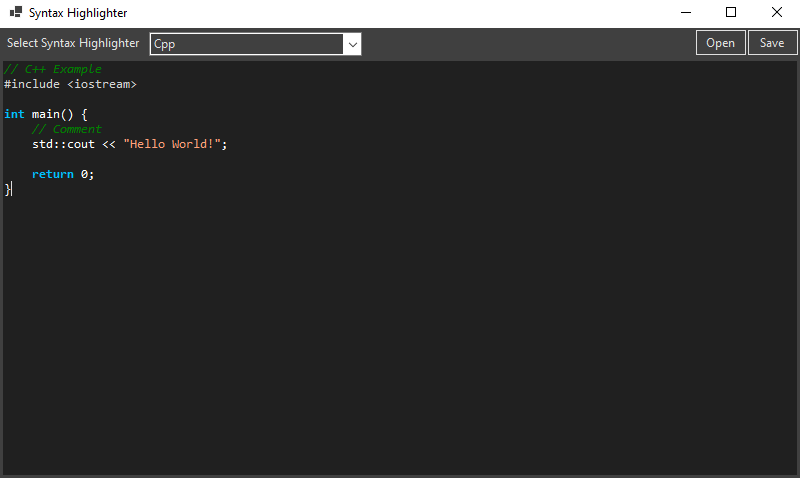

# SyntaxHighlighter in C#

🌍 *[Português](README.md) ∙ [English](README_en.md)*

### Description
This project is a text editor application with syntax highlighting, built using C# and Windows Forms. It supports syntax highlighting for the following languages: JSON, XML, SQL, C++. The highlighter dynamically adjusts the text color in a RichTextBox based on the selected language, improving readability and editing experience.

### Features
- **Multiple Language Support**: Highlights syntax for JSON, XML, SQL, C++, and potentially more, based on system configuration.
- **Dynamic Highlighting**: Automatically updates the highlighting as the text changes.
- **File Interaction**: Opens and saves files directly through the interface, facilitating instant editing and viewing of files.

### Prerequisites
- Microsoft Visual Studio 2022
- .NET SDK 8.0 or higher

### Installation
1. **Clone the repository**: Use Git or checkout with SVN.
2. **Open the solution in Visual Studio**: Navigate to the cloned directory and open the `SyntaxHighlighterCS.sln` file.

### Usage
1. **Launch the application**: Build and run the application through Visual Studio.
2. **Open a file**: Click on the 'Open' button and select a file to load its content into the text editor.
3. **Select the syntax to highlight**: Choose the appropriate syntax from the dropdown menu to start the highlighting process.
4. **Edit and observe changes**: As you modify the text in the editor, the syntax highlighting will update accordingly.
5. **Save your work**: Use the 'Save' button to save the changes back to the file.

### Components
- `FormMain`: The main form that provides the user interface.
- `HighlighterBase`: Abstract base class for creating specific highlighters.
- `HighlighterRules`: Implements highlighting rules based on the selected language.
- `HighlightersOptions`: Enum defining supported syntax highlighting options.

### Editor Interface

### Contributions
Contributions are welcome! Please fork the repository and open a pull request with your improvements. Be sure to follow the existing code style.

### License
Distributed under the [MIT License](LICENSE).
